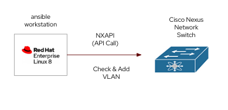

## Ansible Script Example to use with Cisco Nexus



- Ansible use NXAPI call to Cisco switches
- Using Red Hat Ansible Engine on RHEL8
- Target to check and create VLAN on each Cisco Switches ( merged with no deletion)

### Workstation Environment
- RHEL 8
```
Red Hat Enterprise Linux release 8.8 (Ootpa)
```
**Warning**

Using Mac with Apple Silicon will cause problem on some of python package which causing cisco.nexus collection

### Ansible Environment
- Python 3.6.8

```
[redhat@dev-ws nxos]$ python3 --version
Python 3.6.8
[redhat@dev-ws nxos]$ 
```

#### Ansible collection
- cisco.nxos

```
ansible-galaxy collection install cisco.nxos
```

#### Python packages
```
aiohttp              3.8.4
aiosignal            1.2.0
ansible-lint         5.4.0
ansible-pylibssh     1.1.0
async-timeout        4.0.2
asynctest            0.13.0
attr                 0.3.2
attrs                22.2.0
Babel                2.5.1
bcrypt               4.0.1
blivet               3.6.0
bracex               2.2.1
Brlapi               0.6.7
cachetools           4.2.4
certifi              2023.7.22
cffi                 1.15.1
chardet              3.0.4
charset-normalizer   3.0.1
chrome-gnome-shell   0.0.0
commonmark           0.9.1
configobj            5.0.6
cryptography         40.0.2
cupshelpers          1.0
dasbus               1.2
dataclasses          0.8
dbus-python          1.2.4
decorator            4.2.1
docopt               0.6.2
enrich               1.2.7
ethtool              0.14
file-magic           0.3.0
frozenlist           1.2.0
google-auth          2.22.0
gpg                  1.13.1
html5lib             0.999999999
idna                 2.5
idna-ssl             1.1.0
iniparse             0.4
initial-setup        0.3.81.7
isc                  2.0
Jinja2               2.10.1
jmespath             0.9.0
kubernetes           27.2.0
langtable            0.0.51
libcomps             0.1.18
lxml                 4.2.3
MarkupSafe           0.23
multidict            5.2.0
nftables             0.1
ntplib               0.3.3
oauthlib             3.2.2
ordered-set          2.0.2
packaging            21.3
paramiko             3.3.1
perf                 0.1
pexpect              4.3.1
pid                  2.1.1
pip                  21.3.1
ply                  3.9
productmd            1.11
prompt-toolkit       3.0.36
psutil               5.4.3
ptyprocess           0.5.2
pwquality            1.4.4
pyasn1               0.5.0
pyasn1-modules       0.3.0
pycairo              1.16.3
pycparser            2.14
pycups               1.9.72
pycurl               7.43.0.2
pydbus               0.6.0
pyenchant            2.0.0
pyflakes             3.0.1
Pygments             2.14.0
PyGObject            3.28.3
pyinotify            0.9.6
pykickstart          3.16.15
PyNaCl               1.5.0
pyparsing            3.0.9
pyparted             3.11.7
PySocks              1.6.8
python-dateutil      2.6.1
python-dmidecode     3.12.2
python-linux-procfs  0.7.0
python-meh           0.47.2
pytils               0.4.1
pytz                 2017.2
pyudev               0.21.0
pyvim                3.0.3
pyvmomi              7.0.3
pyxdg                0.25
PyYAML               6.0.1
requests             2.20.0
requests-file        1.4.3
requests-ftp         0.3.1
requests-oauthlib    1.3.1
rich                 12.6.0
rpm                  4.14.3
rsa                  4.9
ruamel.yaml          0.17.31
ruamel.yaml.clib     0.2.7
selinux              2.9
sepolicy             1.1
setools              4.3.0
setroubleshoot       1.1
setuptools           39.2.0
simpleline           1.1.3
six                  1.11.0
slip                 0.6.4
slip.dbus            0.6.4
sos                  4.5.6
SSSDConfig           2.8.2
subscription-manager 1.28.36
syspurpose           1.28.36
systemd-python       234
tenacity             8.2.2
tools                0.1.9
typing_extensions    4.1.1
urllib3              1.24.2
urwid                2.1.2
wcmatch              8.3
wcwidth              0.2.6
webencodings         0.5.1
websocket-client     1.3.1
yarl                 1.7.2

```


## Execution
vlan_check.yml


```bash
ansible-playbook -i inventory.ini vlan_check.yml -vv

```

output
```
PLAY [NXOS Query] ********************************************************************************************************************************************************************************************************

TASK [Include vlan vars] *************************************************************************************************************************************************************************************************
ok: [172.16.15.157]

TASK [Query NXOS] ********************************************************************************************************************************************************************************************************
ok: [172.16.15.157]

TASK [VLANs found on NXOS Device] ****************************************************************************************************************************************************************************************
ok: [172.16.15.157] => {
    "msg": []
}

TASK [Build array of vlan ids from vlan var file] ************************************************************************************************************************************************************************
ok: [172.16.15.157]

TASK [VLANs Required] ****************************************************************************************************************************************************************************************************
ok: [172.16.15.157] => {
    "msg": [
        "1000",
        "1001"
    ]
}

TASK [Check for VLAN Existance] ******************************************************************************************************************************************************************************************

TASK [Create vlan] *******************************************************************************************************************************************************************************************************
ok: [172.16.15.157] => (item={'name': 'dev', 'id': '1000'})
ok: [172.16.15.157] => (item={'name': 'prod', 'id': '1001'})

PLAY RECAP ***************************************************************************************************************************************************************************************************************
172.16.15.157              : ok=6    changed=0    unreachable=0    failed=0    skipped=1    rescued=0    ignored=0   

```